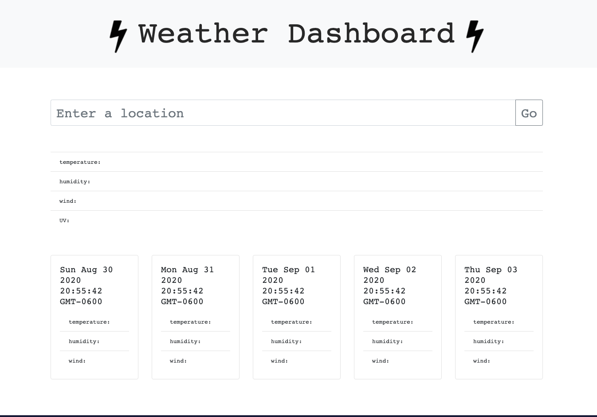

# WEATHER DASHBOARD

### PURPOSE:
The application created enables a user to search for a particular city and get its main weather components for the current time, which is shown at the top of the page along with the current date. For each city searched, the app also shows its five-day forecast. The searches are saved to local storage so that they can be called up again easily by the user.

### USES:
Moment.js, Bootstrap, HTML, CSS, JavaScript and jQuery.

## RUN
To run this project, enter the name of the city in which you would like to know the weather.

### SCREENSHOT

## LINKS
Deployable link: https://maxonemillion.github.io/weather-dashboard/.

Github: https://github.com/maxonemillion/weather-dashboard
